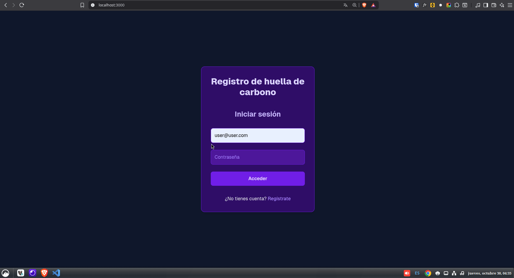
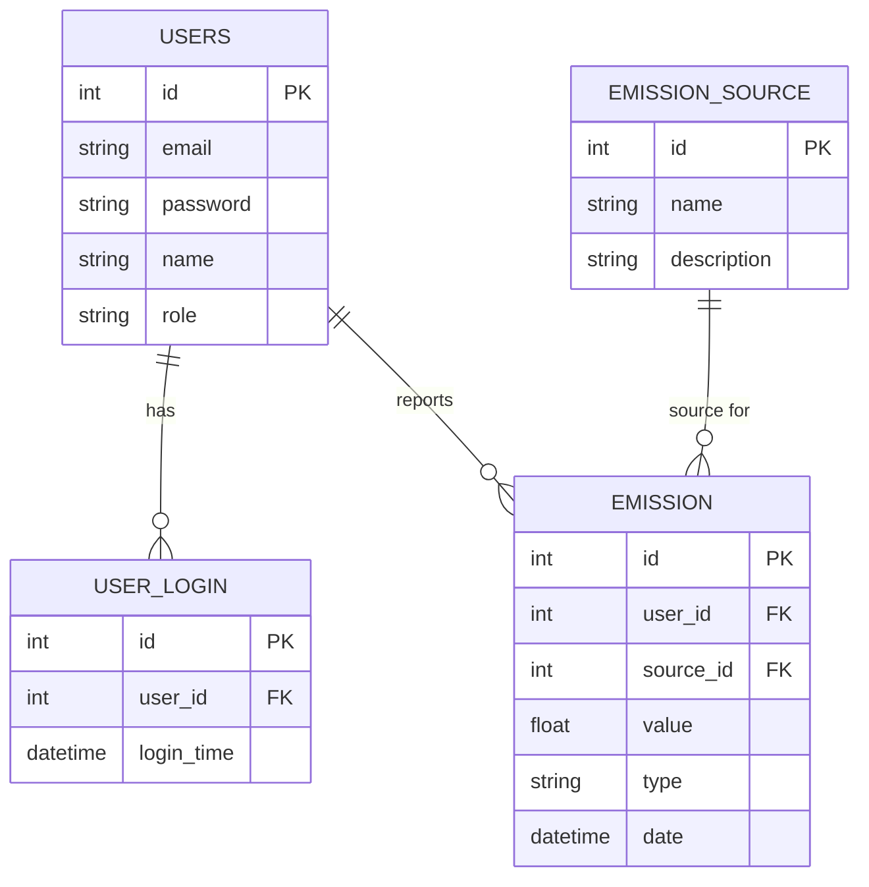

# Lanek - Sistema de Gestión de Huella de Carbono

## Descripción

Lanek es un sistema completo para la gestión de la huella de carbono de usuarios y organizaciones. Permite registrar emisiones, gestionar usuarios y generar reportes detallados. El sistema está compuesto por un backend desarrollado en Flask y un frontend en Next.js, ambos integrados con una base de datos PostgreSQL.

Consulta el documento de instrucciones aquí: [instructions.pdf](./instructions.pdf)

El presente proyuecto se entrega con cariño y dedicación como prueba técnica para la posición de Desarrollador Full Stack en Lanek.

## Demo



## Guía de Instalación y Ejecución

### 1. Pre-requisitos

- Docker y Docker Compose
- Python 3.10+
- Node.js 18+

### 2. Configuración de la Base de Datos

- El sistema utiliza PostgreSQL. La configuración se realiza mediante variables de entorno en el archivo `.env`.
- Puedes visualizar y administrar la base de datos con [Adminer](http://localhost:8080).
- El diagrama relacional se encuentra arriba.

### 3. Ejecución del Backend (Flask)

- Ubicado en `back-lanek/src/app.py`.
- Instala dependencias:
  ```bash
  cd back-lanek
  pip install -r requirements.txt
  python src/app.py
  ```
- Documentación Swagger disponible en: [http://localhost:5000/api/docs](http://localhost:5000/api/docs)

### 4. Ejecución del Frontend (Next.js)

- Ubicado en `front-lanek`.
- Instala dependencias:
  ```bash
  cd front-lanek
  npm install
  npm run dev
  ```
- Accede a la app en [http://localhost:3000](http://localhost:3000)

### 5. Ejecución con Docker Compose

- Ejecuta todo el sistema con:
  ```bash
  docker compose up --build
  ```
- Servicios disponibles:
  - Backend: [http://localhost:5000](http://localhost:5000)
  - Frontend: [http://localhost:3000](http://localhost:3000)
  - Adminer: [http://localhost:8080](http://localhost:8080)

---

## Seeder de Datos

- El backend incluye un seeder para poblar la base de datos con datos de ejemplo.
- Puedes probar el sistema creando un usuario nuevo o usando el usuario de prueba:
  - **Usuario:** user@user.com
  - **Contraseña:** user

---

## Referencias

- **Swagger:** [http://localhost:5000/api/docs](http://localhost:5000/api/docs)
- **Adminer:** [http://localhost:8080](http://localhost:8080)

---

## Diagrama Entidad-Relación (ER)



## Tabla de Datos de la Base de Datos

| Tabla           | Campo       | Tipo     | Descripción                          |
| --------------- | ----------- | -------- | ------------------------------------ |
| users           | id          | int      | Identificador único del usuario (PK) |
|                 | email       | string   | Correo electrónico                   |
|                 | password    | string   | Contraseña cifrada                   |
|                 | name        | string   | Nombre completo                      |
|                 | role        | string   | Rol del usuario (admin/user)         |
| user_login      | id          | int      | Identificador único de login (PK)    |
|                 | user_id     | int      | Relación al usuario (FK)             |
|                 | login_time  | datetime | Fecha y hora de login                |
| emission        | id          | int      | Identificador único de emisión (PK)  |
|                 | user_id     | int      | Relación al usuario (FK)             |
|                 | source_id   | int      | Relación a la fuente de emisión (FK) |
|                 | value       | float    | Valor de la emisión                  |
|                 | type        | string   | Tipo de emisión                      |
|                 | date        | datetime | Fecha de la emisión                  |
| emission_source | id          | int      | Identificador único de fuente (PK)   |
|                 | name        | string   | Nombre de la fuente                  |
|                 | description | string   | Descripción de la fuente             |

---

© 2025 Guillermo Torres Renner. Todos los derechos reservados.
